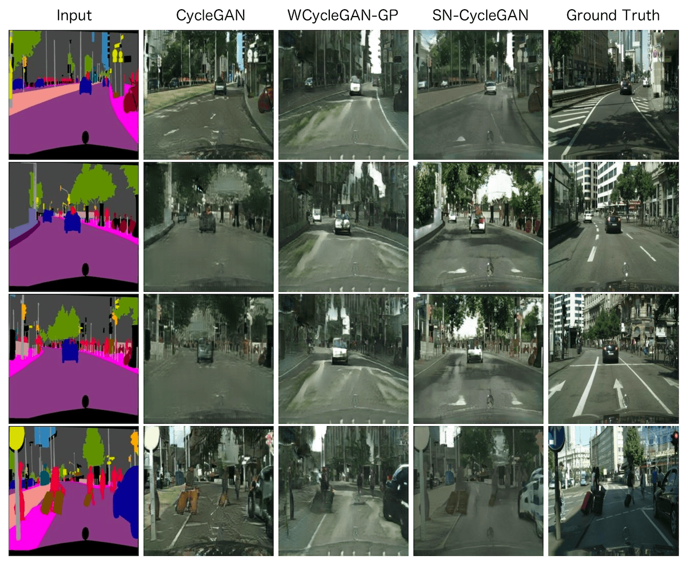
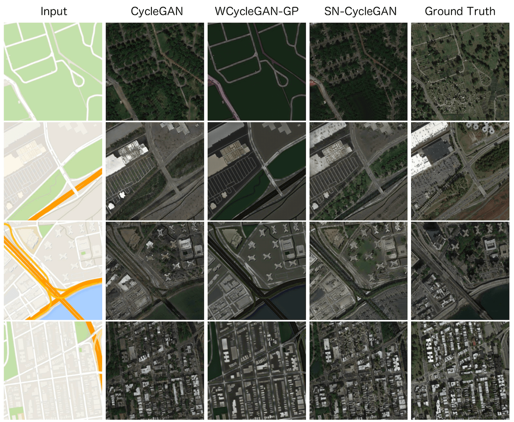
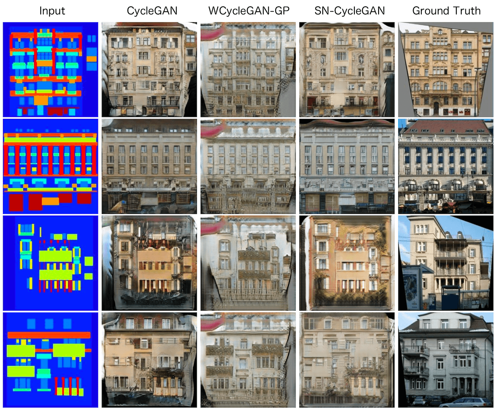

# SN-CycleGAN

CycleGAN with Spectral Normalization on the discriminator weights

### Information

This project was realiazed for the Object Recognition and Computer Vision course that we had in M.Sc. MVA (ENS Paris-Saclay).

I work on this project with Matthieu Toulemont. Link of his GitHub https://github.com/MattToul

The results that we obtain and the details about the implemention are shown in report.pdf, in the report file.
The report was limited to 3 pages (+images).

In our code and our report, we also compared the CycleGAN with Spectral Normalization to another method that stabilized the training of GANs ; the WGAN-GP

Our code is based on the original CycleGAN implementation in Pytorch that you can find here https://github.com/junyanz/pytorch-CycleGAN-and-pix2pix

## Results

Images come from the "labels→photo" generator for different methods on :

* Cityscapes dataset

* data scraped from Google Maps

* CMP Facaces

